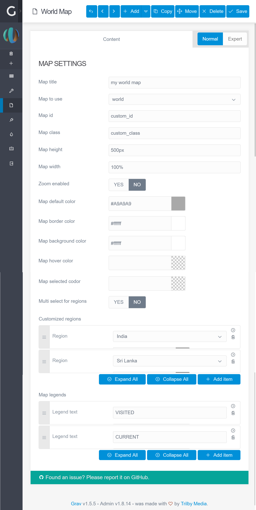

# World Maps Plugin

**This README.md file should be modified to describe the features, installation, configuration, and general usage of this plugin.**

The **World Maps** Plugin is for [Grav CMS](http://github.com/getgrav/grav). This plugin provides customizable and vectorial world maps.

Every regions of the map is clickable and editable by color and link reference.


## Installation

Installing the World Maps plugin can be done in one of two ways. The GPM (Grav Package Manager) installation method enables you to quickly and easily install the plugin with a simple terminal command, while the manual method enables you to do so via a zip file.

### GPM Installation (Preferred)

The simplest way to install this plugin is via the [Grav Package Manager (GPM)](http://learn.getgrav.org/advanced/grav-gpm) through your system's terminal (also called the command line).  From the root of your Grav install type:

    bin/gpm install world-maps

This will install the World Maps plugin into your `/user/plugins` directory within Grav. Its files can be found under `/your/site/grav/user/plugins/world-maps`.

### Manual Installation

To install this plugin, just download the zip version of this repository and unzip it under `/your/site/grav/user/plugins`. Then, rename the folder to `world-maps`. You can find these files on [GitHub](https://github.com/widebob/grav-plugin-world-maps) or via [GetGrav.org](http://getgrav.org/downloads/plugins#extras).

You should now have all the plugin files under

    /your/site/grav/user/plugins/world-maps
	
> NOTE: This plugin is a modular component for Grav which requires [Grav](http://github.com/getgrav/grav) and the [Error](https://github.com/getgrav/grav-plugin-error) and [Problems](https://github.com/getgrav/grav-plugin-problems) to operate.

### Admin Plugin

If you use the admin plugin, you can install directly through the admin plugin by browsing the `Plugins` tab and clicking on the `Add` button.

## Configuration

Before configuring this plugin, you should copy the `user/plugins/world-maps/world-maps.yaml` to `user/config/plugins/world-maps.yaml` and only edit that copy.

Here is the default configuration and an explanation of available options:

```yaml
enabled: true
default-id: 'world-maps-plugin'
default-class: ''
default-height: '500px'
default-width: '100%'
default-shape: 'world'
default-color: '#A9A9A9'
default-background-color: '#FFFFFF'
default-border-color: '#FFFFFF'
default-hover-color: null
default-selected-color: null
default-multiselect-region: false
default-enable-zoom: false
```

Note that if you use the admin plugin, a file with your configuration, and named world-maps.yaml will be saved in the `user/config/plugins/` folder once the configuration is saved in the admin.

## Usage

There is two ways to integrate your map in a page. You can use it by simply add Shortcode in your page content (see **ShortCode example** section). Or you can populate the page headers (see **Page header example** section)

> IMPORTANT: Don't forget to include you assets with `{{ assets.js() }}` in your base Twig template. Otherwhise the World Maps plugin will not works properly.

Shortcode or header use both a **map** object configuration, that can contain **region** children and **legend** children with their own configurations.

Options are available in ShortCode tag and in your Markdown header variables

**map**
- **title**: Displayed map title
- **shape**: Name of vectorial map to use 
- **id**: HTML map element id
- **class**: HTML map element class
- **height**: HTML map element height
- **width**: HTML map element width
- **color**: color used by default for map's regions
- **border_color**: map's regions border color
- **background_color**: map's background color
- **hover_color**: map's regions hover color
- **selected_color**: map's regions selected color
- **zoom_enabled**: Enable or not zoom buttons
- **multi_select_region**: Enable or not multi region selection
    
**region**
- **ref**: Region/Country code name
- **color**: Given region color
- **link**: Link to open on region click

**legend**
- **text**: Legend's text/label
- **color**: Color used for text/label

### Page header example :
```yaml
---
title: 'World Map'
cache_enable: false
map:
    title: 'my world map'
    shape: world
    id: custom_id
    class: custom_class
    height: 300px
    width: 100%
    color: '#A9A9A9'
    border_color: '#FFF'
    background_color: '#FFF'
    hover_color: null
    selected_color: null
    zoom_enabled: false
    multi_select_region: false
    regions:
        -
            ref: ar
            color: '#db3434'
            link: /home
        -
            ref: us
            color: '#4f49c9'
            link: /thankyou
    legends:
        -
            text: TEST
            color: '#db3434'
        -
            text: TEST2
            color: '#4f49c9'
---
```

### ShortCode example :
#### World map

```markdown
[map shape="world" id="myworldmap"]
    [region ref="us" color="#666" link="thankyou"][/region]
    [region ref="in" color="#666" link="thankyou"][/region]
    [region ref="fr" color="#123456" link="thankyou"][/region]
    [region ref="au" color="#666" link="thankyou"][/region]
    [legend text="VISITED" color="#666"][/legend]
    [legend text="CURRENT" color="#123456"][/legend]
[/map]
```

#### Europe map

```markdown
[map shape="europe" id="myeuropedmap"]
    [region ref="ro" color="#666" link="thankyou"][/region]
    [region ref="fr" color="#123456" link="thankyou"][/region]
    [region ref="fi" color="#666" link="thankyou"][/region]
    [legend text="VISITED" color="#666"][/legend]
    [legend text="CURRENT" color="#123456"][/legend]
[/map]
```

## Blueprint import :

You can integrate the World Maps plugin blueprint as a partial element in any of your own blueprints. Just use those 3 lines in your blueprint template :

```yaml
import@:
  type: partials/map
  context: blueprints:// 
```

### Import example
```yaml

title: WorldMap
# Uncomment to extend from default
#'@extends': default

form:
    fields:
        tabs:
            type: tabs
            active: 1

            fields:

              # Inside existing tab
              content:
                  type: tab
                  title: Content

                  fields:
                    map_settings:
                      type: section
                      title: MAP SETTINGS
                      import@:
                        type: partials/map
                        context: blueprints://
                  
              # Inside a new tab
              map:
                content:
                  type: tab
                  title: Map
                  ordering@: content # Set the Map tab after Content tab
                  import@:
                    type: partials/map
                    context: blueprints://
```

### Admin render




## Credits

Thanks to [Peter Schmalfeldt](https://github.com/manifestinteractive) and [10 Best Design](https://github.com/10bestdesign) for [JQVMap]( https://github.com/10bestdesign/jqvmap) development and maintenance.

## To Do

- Add missing JQVMap parameters in config and blueprint
- Add default values in parial blueprint `map.yaml` from config file `world-maps.yaml`
- Check incoming parameter values in `map.html.twig` and set default values if missing to prevent errors

