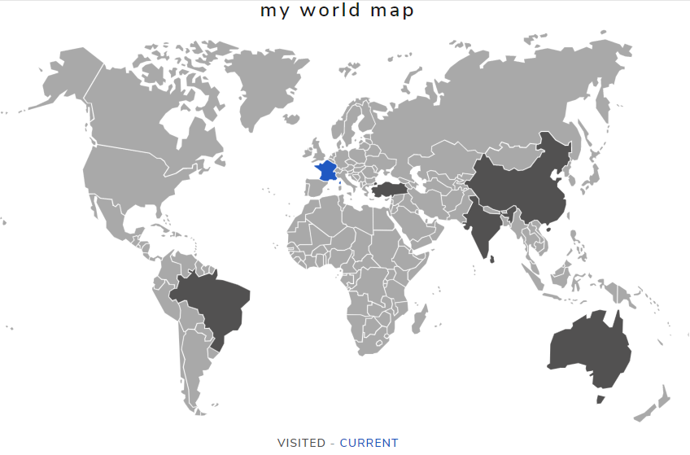
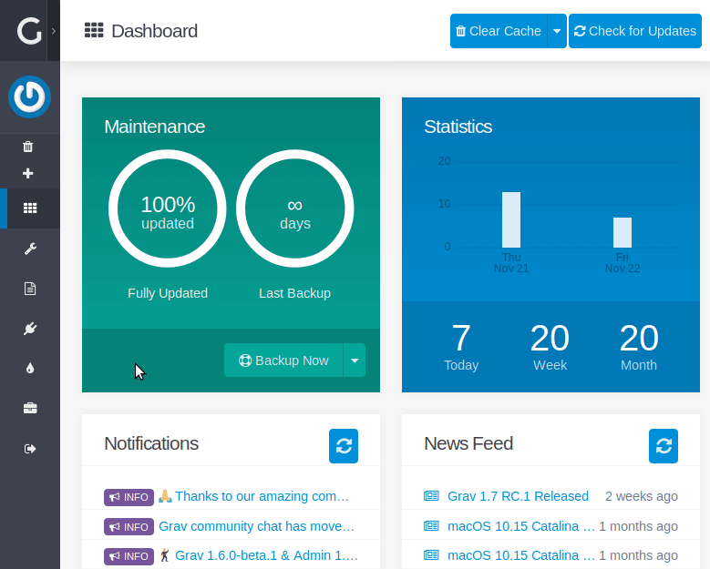
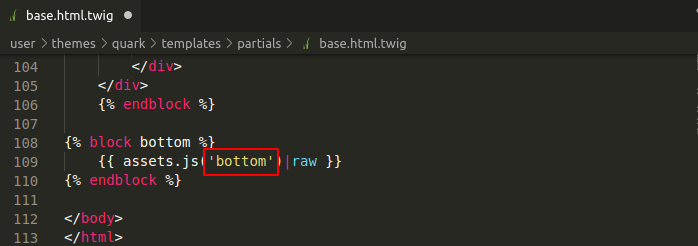
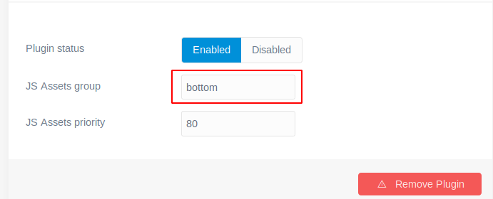
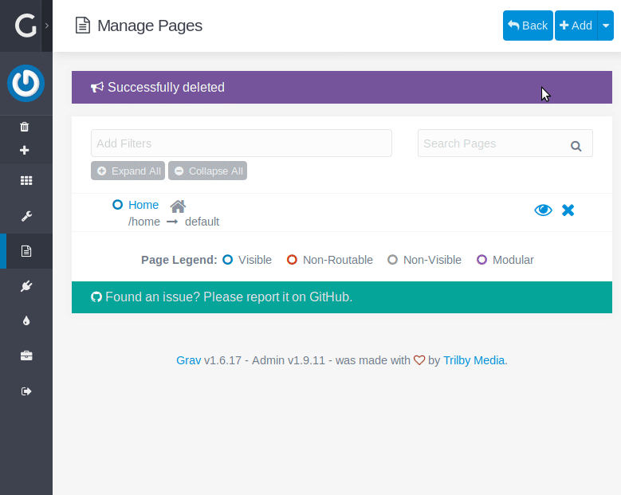
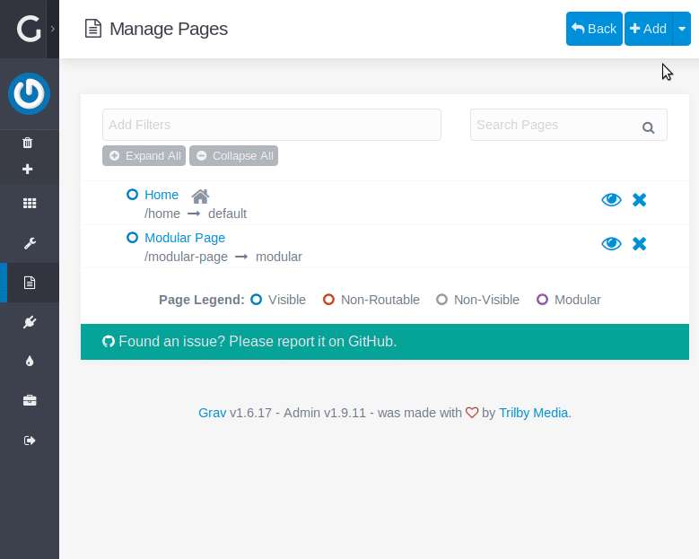

# World Maps Plugin

The **World Maps** Plugin is for [Grav CMS](http://github.com/getgrav/grav). This plugin provides customizable and vectorial world maps.

Every regions of the map is clickable and editable by color and link reference.



---

## Installation

> NOTE: This plugin is a modular component for Grav which requires [Grav](http://github.com/getgrav/grav) and the [Error](https://github.com/getgrav/grav-plugin-error) and [Problems](https://github.com/getgrav/grav-plugin-problems) to operate.

### Admin Plugin interface (Preferred)

If you use the admin plugin, you can install directly through the admin plugin by browsing the `Plugins` tab and clicking on the `Add` button.



### GPM Installation

Using the [Grav Package Manager (GPM)](http://learn.getgrav.org/advanced/grav-gpm) through your system's terminal.

``` bash
cd /your/grav-site
bin/gpm install world-maps
```
This will install the World Maps plugin under `/your/grav-site/user/plugins/world-maps`.

### Git Installation

To install this plugin, just download source code of this repository under `/your/grav-site/grav/user/plugins` with Git command. 

``` bash
cd /your/grav-site
git clone https://github.com/Widebob/grav-plugin-world-maps.git user/plugins/world-maps
```

---

## Plugin Configuration

Before configuring this plugin, you should copy the `user/plugins/world-maps/world-maps.yaml` to `user/config/plugins/world-maps.yaml` and only edit that copy.

Here is the default configuration and an explanation of available options:

```yaml
enabled: true                       # plugin activation
js_group: ''                        # JS assets group used for this plugin
js_priority: 80                     # JS assets priority used for this plugin
default_id: 'world-maps-plugin'     # default map ID
default_class: ''                   # default map css class
default_height: '500px'             # default map height
default_width: '100%'               # default map width
default_shape: 'world'              # default map shape
default_color: '#A9A9A9'            # default countries color
default_border-color: '#FFFFFF'     # default countries border color
default_hover-color: null           # default countries hover color
default_selected-color: null        # default countries selected color
default_background-color: '#FFFFFF' # default background color
default_multiselect-region: false   # enable multi country selection
default_enable-zoom: false          # enable map zoom
```

> NOTE: if you use the admin plugin, the world-maps.yaml file will be automatically saved in the `user/config/plugins/` folder once the configuration is saved in the admin interface.

---

## /!\ Theme and assets configuration


Check your Theme's base Twig template to get the `assets group` used with it, and specify this group in the World Maps plugin configuration with the _JS Assets group_ field. **Otherwhise the World Maps plugin will not works properly.** 

Here an example of `base.html.twig` for Grav main theme :


You can specify this parameter in `user/config/plugins/world-maps.yaml` configuration file with the `js_group` value.

```yaml
enabled: true
js_group: 'bottom'
js_priority: 80
```

You can also specify it in the Grav Admin interface



If you don't want to specify a group for your assets, you can change your theme block and leave assets without any group :
```twig

    {{ assets.js() }} {# a base template example without group #}

``` 

----

## Usages

### Grav Admin interface

Page example



Page modular example



### Page header example :
```yaml
---
title: 'World Map'
cache_enable: false
map:
    title: 'my world map'       # displayed map title
    shape: world                # name of vectorial map to use 
    id: custom_id               # HTML map element id
    class: custom_class         # HTML map element class
    height: 300px               # HTML map element height
    width: 100%                 # HTML map element width
    color: '  #A9A9A9'          # color used by default for map's regions
    border_color: '#FFF'        # map's regions border color
    background_color: '#FFF'    # map's background color
    hover_color: null           # map's regions hover color
    selected_color: null        # map's regions selected color
    zoom_enabled: false         # enable or not zoom buttons
    multi_select_region: false  # enable or not multi region selection
    regions:
        -
            ref: ar             # region/Country code name
            color: '#db3434'    # given region color
            link: /home         # link to open on region click
        -
            ref: us
            color: '#4f49c9'
            link: /thankyou
    legends:
        -
            text: TEST          # legend's text/label
            color: '#db3434'    # color used for text/label
        -
            text: TEST2
            color: '#4f49c9'
---
```

### ShortCode example :
#### World map

```markdown
[map shape="world" id="myworldmap"]
    [region ref="us" color="#666" link="thankyou"][/region]
    [region ref="in" color="#666" link="thankyou"][/region]
    [region ref="fr" color="#123456" link="thankyou"][/region]
    [region ref="au" color="#666" link="thankyou"][/region]
    [legend text="VISITED" color="#666"][/legend]
    [legend text="CURRENT" color="#123456"][/legend]
[/map]
```

#### Europe map

```markdown
[map shape="europe" id="myeuropedmap"]
    [region ref="ro" color="#666" link="thankyou"][/region]
    [region ref="fr" color="#123456" link="thankyou"][/region]
    [region ref="fi" color="#666" link="thankyou"][/region]
    [legend text="VISITED" color="#666"][/legend]
    [legend text="CURRENT" color="#123456"][/legend]
[/map]
```


## Blueprint import :

You can integrate the World Maps plugin blueprint as a partial element in any of your own blueprints. Just use those 3 lines in your blueprint template :

```yaml
import@:
  type: partials/map
  context: blueprints:// 
```

### Import example
```yaml

title: WorldMap
# Uncomment to extend from default
#'@extends': default

form:
    fields:
        tabs:
            type: tabs
            active: 1

            fields:

              # Inside existing tab
              content:
                  type: tab
                  title: Content

                  fields:
                    map_settings:
                      type: section
                      title: MAP SETTINGS
                      import@:
                        type: partials/map
                        context: blueprints://
                  
              # Inside a new tab
              map:
                content:
                  type: tab
                  title: Map
                  ordering@: content # Set the Map tab after Content tab
                  import@:
                    type: partials/map
                    context: blueprints://
```

## Credits

Thanks to [Peter Schmalfeldt](https://github.com/manifestinteractive) and [10 Best Design](https://github.com/10bestdesign) for [JQVMap]( https://github.com/10bestdesign/jqvmap) development and maintenance.


